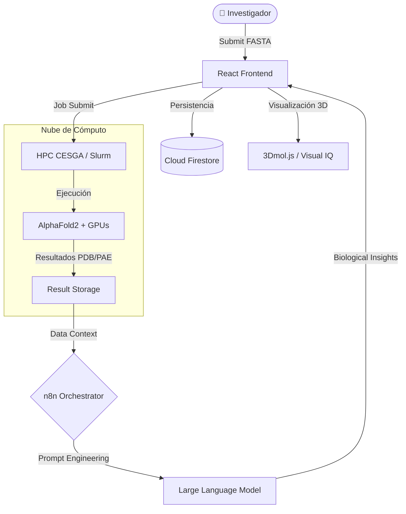

#  Micafold

[](https://github.com/JoseEstevez520/Impacthon_investigacion)
[](https://github.com/JoseEstevez520/Impacthon_investigacion)
[](https://www.cesga.es/)
[](https://github.com/JoseEstevez520/Impacthon_investigacion)

**Micafold** bridges the gap between high-performance computing and biological intuition. Developed during **Impacthon 2026**, it is an AI-augmented platform designed for researchers to fold, visualize, and interpret protein structures with the power of CESGA infrastructure.

---

## 🌟 The Vision: Personalización sin Frustración

La biología estructural suele estar frenada por flujos de trabajo basados en terminales y métricas crípticas. **Micafold** transforma esta experiencia en un viaje visual e intuitivo.

> [!TIP]
> **Nuestra apuesta**: La personalización total de la experiencia del usuario. Eliminamos la barrera de entrada técnica, ahorrando iteraciones innecesarias, tiempo y sobre todo la **frustración** habitual en el proceso de investigación bioinformática.

Este proyecto democratiza el acceso a herramientas de vanguardia como **AlphaFold2**, permitiendo que los investigadores se centren en lo que realmente importa: el descubrimiento científico.

---

## 🏗️ Technical Architecture

Micafold utiliza una arquitectura desacoplada para garantizar escalabilidad y seguridad en entornos de supercomputación.



---

## 🚀 Core Features

### 🤖 ProteIA: Asistente de Investigación IA
Integrado en todo el flujo para traducir datos crudos en conocimiento biológico:
- **Resúmenes Inteligentes**: Generación automática de reportes científicos basados en los resultados del plegamiento.
- **Chat Contextual**: Pregunta a ProteIA sobre regiones específicas, mutaciones o implicaciones clínicas.
- **Diagnóstico Humano**: Traduce errores complejos de HPC/Slurm en consejos biológicos accionables.

### 🔬 Inteligencia Visual Científica
- **Visor 3D Interactivo**: Renderizado de alta fidelidad de estructuras PDB/mmCIF.
- **Interpretación de Métricas**: Mapeo visual de pLDDT (confianza) y matrices PAE traducidas a lenguaje natural.
- **Exportación en un Click**: Descarga reportes listos para publicación y archivos estructurales.

---

## 🛠️ Technology Stack

| Capa | Tecnologías |
| :--- | :--- |
| **Frontend** | React 19, Vite, Tailwind CSS, Framer Motion |
| **Visualización** | 3Dmol.js, Plotly.js (PAE Heatmaps) |
| **Orquestación IA** | n8n (Agentic Workflows), LLMs especializados |
| **Infraestructura** | CESGA HPC (AlphaFold2, Slurm), Firebase Firestore |

---

## 📂 Repository Structure

Para mantener el proyecto profesional y organizado, el repositorio se estructura así:

*   **`frontend/`**: Aplicación cliente (React + Vite + Tailwind).
*   **`docs/`**: Base de conocimientos técnica y estratégica.
    *   `investigacion/`: Análisis de mercado, usuarios y retos técnicos.
    *   `presentacion/`: Materiales de pitch y estrategia.
    *   `Documentacion/`: Guías de API y manuales técnicos.
*   **Root**: Configuraciones de Firebase, Git y dependencias esenciales.

---

## 🚦 Getting Started

### Instalación Rápida
1. **Clonar**: `git clone https://github.com/JoseEstevez520/Impacthon_investigacion.git`
2. **Setup Frontend**: 
   ```bash
   cd frontend
   npm install
   npm run dev
   ```

---

## 👥 Equipo
Desarrollado con ❤️ por el **Micafold Team** durante la **Impacthon 2026** en el CESGA.

---

## 📄 Final Notes
Este repositorio contiene tanto el código fuente como la documentación de investigación completa de la plataforma Micafold. El proyecto se mantiene como una prueba de concepto (PoC) del futuro de la biología estructural accesible en entornos de computación de alto rendimiento.
